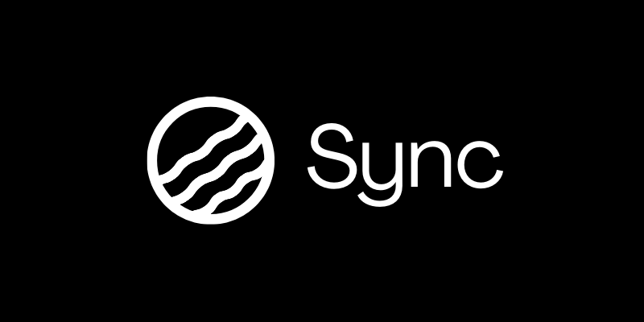

# Sync

### Visual CI/CD for the Enterprise
**The first deterministic infrastructure for Generative AI.**



*(Note: Replace this image with a screenshot of your dashboard interface)*

---

## The Problem: The Hallucination Barrier

In software development, DevOps practices ensure code consistency; changing a configuration results in predictable output changes.

In Generative AI, this infrastructure is missing:
* **Inconsistency:** Standard models drift significantly between generations. It is currently difficult to request an exact lighting setup across multiple distinct assets.
* **Unscalable Workflows:** Marketing teams rely on "Prompt Engineering," which is fragile, subjective, and unsuited for enterprise production at scale.
* **Compliance Risks:** Brands cannot risk generating assets that violate strict color palettes or visual identity guidelines.

## The Solution: Sync

**Sync** transforms image generation from a creative task into an **infrastructure process**. It treats Brand Guidelines as **Configuration-as-Code**.

Instead of prompting an AI with vague descriptions, Sync manages a centralized `sync.json` state. When the configuration is updated, the system automatically regenerates the asset library using the **Bria FIBO Foundation Model**, ensuring mathematical consistency across every image.

> **Concept:** GitHub Actions for Brand Assets.

---

## Key Features

### 1. Configuration as Code
The entire visual identity of a campaign is defined in a single, version-controllable JSON file.
* **Brand Lock:** Enforce immutable rules (e.g., specific Hex codes, Camera Angles, Lighting conditions).
* **Manifest:** A structured list of assets to generate (e.g., Sneakers, Bags, Bottles).

### 2. Deterministic "Diffs"
Because Sync utilizes Bria FIBO's structured parameters, it enables "Visual Refactors."
* **Action:** Change `"lighting": "studio"` to `"lighting": "neon"` in the code.
* **Result:** The entire product catalog regenerates. The products and camera angles remain identical; only the lighting updates globally.

### 3. Video & Motion Pipelines (Beta)
Sync is expanding beyond static images. We are building the rails for **Video CI/CD**, allowing brands to define motion paths and transition styles in code, ensuring that video assets adhere to the same strict brand guidelines as static imagery.

### 4. Commercial Safety
Built on **Bria FIBO**, the only foundation model trained on fully licensed data. Sync ensures that every generated pixel is indemnity-ready for enterprise use.

---

## Technical Architecture

Sync is built on **Next.js 14** and communicates directly with the **Bria.ai API**.

### The Payload Strategy
We bypass standard prompt engineering by constructing a strict JSON payload that maps directly to FIBO's control layers.

**Example Request (Bria Schema):**
```json
{
  "prompt": "A minimalist white sneaker",
  "num_results": 1,
  "sync": true, 
  "structured_prompt": {
    "photographic_characteristics": {
       "camera_angle": "low_angle",
       "depth_of_field": "shallow"
    },
    "lighting": {
       "conditions": "studio_lighting",
       "direction": "diffused"
    },
    "aesthetics": {
       "color_scheme": "minimalist"
    }
  }
}
## Tech Stack

- **Frontend:** Next.js 14 (App Router), React  
- **Styling:** Tailwind CSS (Custom IDE-style Dark Theme)  
- **Icons:** Lucide React  
- **AI Engine:** Bria FIBO (v1/text-to-image/fibo)  
- **API Handling:** Next.js API Routes (Server-side Proxy)  

---

## Quick Start Guide

### Prerequisites

- Node.js 18+
- A Bria.ai API Token

### 1. Clone the Repository

```bash
git clone https://github.com/yourusername/sync.git
cd sync
```

### 2. Install Dependencies

```bash
npm install
# or
yarn install
```

### 3. Configure Environment

Create a `.env.local` file in the root directory and add your Bria API token:

```bash
BRIA_API_TOKEN="your_bria_api_key_here"
```

### 4. Run the Development Server

```bash
npm run dev
```

Then open [http://localhost:3000](http://localhost:3000) to access the Sync dashboard.

---

## Demonstration Workflow

1. **Open the Dashboard:**  
   The interface displays the `sync.json` editor on the left and an empty grid on the right.

2. **Initial State:**  
   Observe the default JSON configuration. The lighting is set to `studio_lighting`.

3. **Run Sync:**  
   Click the **SYNC STATE** button. The assets are generated with consistent studio lighting.

4. **The Refactor:**  
   Edit the JSON in the left panel. Change `"conditions": "studio_lighting"` to `"conditions": "neon_lights"`.

5. **Re-Sync:**  
   Click the button again. Observe that the composition of the images remains identical, but the lighting environment has completely shifted.

---

## Future Roadmap

- **Motion Sync:** Full implementation of Bria's Motion API to allow for "Video Configs" (e.g., defined pan speeds, zoom levels, and transition styles).
- **Git Hooks:** Trigger asset generation automatically when a developer pushes code to a GitHub repository.
- **Figma Plugin:** Allow designers to pull the latest generated assets directly into their design files.
- **HDR Pipeline:** Leverage FIBO's 16-bit capabilities to generate HDRI environment maps for 3D rendering pipelines.

---

## License & Acknowledgments

- **Model:** Powered by Bria.ai FIBO.
- **License:** MIT License.